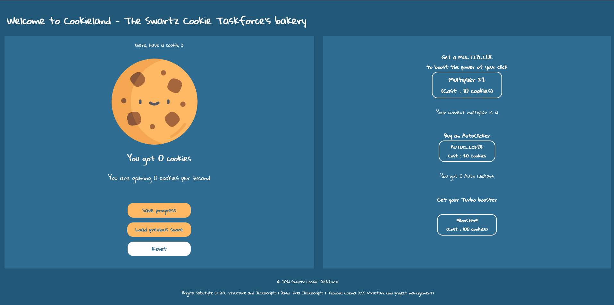

# Javascript - Cookie Clicker

**Assignment source** : https://github.com/becodeorg/BXL-Swartz-5.34/blob/main/1.The-Field/12.Javascript/cookieClicker.md

**Link to live version** : https://teo-cozma.github.io/Javascript/

## Team members
- Brigita Sabutyte (Javascript and HTML)
- David Tirel (Javascript)
- Teodora Cozma (HTML and CSS)

## Languages

- HTML
- CSS
- Javascript

## Tools

- Visual Studio Code (text editor)
- Discord, Google Meet, Github, Replit (Communication)
- Adobe XD (prototyping)
- W3C Markup Validation Service (HTML inspection)
- W3C CSS Validation Service (CSS inspection)
- Google Lighthouse (performance inspection)

## Image

## Resources

What is a Cookie Clicker ?

- http://orteil.dashnet.org/cookieclicker/
- https://en.wikipedia.org/wiki/Cookie_Clicker 
- https://cookie-clicker2.com/
- https://particle-clicker.web.cern.ch/
- https://www.youtube.com/watch?v=2Dx76lD8Scc&t=69s 

Tutorials for our project :

- https://www.flaticon.com/free-icons/cookie 
- https://www.youtube.com/watch?v=uUgOBe_wb6E
- https://www.youtube.com/watch?v=j_nI6G3ZDiE 

- https://codesource.io/how-to-disable-button-in-javascript/
- https://stackoverflow.com/questions/57477529/disable-a-button-if-empty-input
- https://www.youtube.com/watch?v=PSEhNb69XpI
- https://www.youtube.com/watch?v=vU2akkcSV-g
- https://www.youtube.com/watch?v=PSEhNb69XpI
- https://www.youtube.com/watch?v=KgYkgBno5Gs

- https://stackoverflow.com/questions/8583524/how-to-set-time-limit

Validation services :

- https://validator.w3.org/#validate_by_input
- http://jigsaw.w3.org/css-validator/

---

## Project log

### Day one (25/10) 

#### Instructions review

- What : Cookie Clicker.
- Why : consolidation project (mainly of Javascript skills).
- When : Starting today, 4 full days of team work, until 28/10.
- How : in groups of three, collaborating, and using respective code languages.
- Who : Teodora Cozma, Brigita Sabutyte, David Tirel.
    - Which roles ? There's frontend, backend and project management. All roles can be interchangeable and the code is shared anyways, but overall, one person can focus more on a given role.
        - Backend (Javascript) : David.
        - Backend (Javascript) + Frontend (HTML structure) : Brigita.
        - Frontend (CSS + maybe Sass) + Project Manager : Teodora.

#### Brainstorming

**3 sections :**

1. Cookie section : Header 1 for the cookie counter. H1 for the amount of clicks.
    - Interactive cookie + its title + cookie counter = 1st section.
    - "Within the HTML, put a click button which will increment a counter and a label initialised at 0 to display said counter."

2. Score section :
    - Score section : score count.
    - 1 cookie : the cookie is its own button.

*(Cookie + score = left half)*

3. Store section :
    - Achievements and upgrades ?
    - Store section = button upgrade clicker + point counter = 2nd section :
        - Make a multiplier (double or triple points) --> this step for review
        - Multiplier price (purchased)
        - Score updating
        - Counter within the multiplier
        - Cost increase (the cost of higher multiplier)
            - Dedicated display as well (a button underneath ?)

        - Step 12 : necessary element, certain buttons are deactivated. ex: under 20 points, player can't access certain features.

*(Right half)*

Example (reference) : http://orteil.dashnet.org/cookieclicker/.

##### Tasks for today

**This morning (10:30 - 12:30)**

- Research on the project (assignment instructions).
    - See what corresponds with the current mandatory steps (bonuses are set aside for the moment).
- Indepth look at the code of the original cookie clicker.

(https://www.youtube.com/watch?v=2Dx76lD8Scc&t=69s)
*Description of the game (and its existential qualities!)*
- 1 click = 1 cookie.
- 15 clicks = 15 cookies = 1 cursor (purchased).
- 10 cursors = 1 cookie/sec (CpS).
- 100 cookies = grandma that produces and markets your cookies.
- Cookies are currency that allows you to purchase farms, mines, factories, etc.
= cookie economy that is permeating and overwhelming. This expands into an eventual cookieverse.
- Transcendance of existence = Ascend and start again.
- Golden cookie spawns randomly.
- Whatch out for the grandma's : potential rebellion and apocalypse. Save everyone with economic gain, or exploit them to make more wealth.
- Small "code hack" in the console : Game.Earn(x).

(http://orteil.dashnet.org/cookieclicker/)

*Info log/Version history*

- Safe saving
- Cursor display style
- Import/export feature : retrieve a save game from an onld version (disabled after a week)
- Sell button
- Random golden cookie (how to determine its frequency)
- Clicking stats
- Clicking boosts
- Grandma discontent and apocalypse --> creatures spawned that consume cookies
- Stats menu section for upgrades and achievements
    - Milk flavour achievements -_- 
- Options menu : 
    - General : save + auto save, export/import, wipe save ; 
    - Settings : volume, fancy graphics, sounds... these are all bonuses.

*Behind the code (investigated with the inspector)*
- **HTML structure** (what we might retain for the appearance):
    - Head : all the links to styles and scripts (the Title is blinking...)
    - Body : 
        - No banner wrappers
        - Topbar : copyright and link to Social Media (like a footer but at the top of the page). We'll definitely need to include the copyright stuff with our names, this year and links to our landing pages (?).
        - Div id:"game" : the actual section of the game.
            - The sections are under the tag "section", and have their own names depending on their position (left, right, middle) + seperators.
            - Anchors : are they their own class type ? Look it up.
            - **Cookie anchor = clickable cookie !!!**
                - Canvas tag
            - Do we add a fictional backery name ?
            - Cookie counter : x cookies ; per second : s.
        - Do we create a menu with options, stats, info,... ?
            - Also, subsection for each menu item ?
        - (Technical issue : the page keeps refreshing to update data to it's hard to stay on one section to take a look at the code, before it blinks)
        - "b" tag : what's it for ?
        - Some divs are hidden ?
        - Store section :
            - Buy/Sell : these should be linked to Javascript events as their values will change with each click.
            - Products (mines, grandmas) : when the game first starts, these should be hidden/obscured.
*(Another interesting reference : https://particle-clicker.web.cern.ch/)*

**This afternoon (13:30 - 17:00)**

- Gathering ideas, research, and pooling resources.
- What technical difficulties/challenges may lie ahead ?
    - How does the multiplier work ?
    - Display an layout of sections and their buttons (though this is not particularly worrysome).
    - Understanding how to apply Javascript.
        - Gather resources and information on how to write the code for each button.

**What is our groupwork methodology ?**
- How does each one of us work ?
    - Alone
    - Research focused
    - Coding focused
    - Do we do "live coding sessions", where we share our screen and type code, and each one gives their input on the spot ?
- How can we make this deadline work for us ?
- How do we split the coding work ? How do we determine following tasks and delegate them ? If we each work on our own time, how do we agree on and consolidate the final code ?

- Deciding how to communicate and share information :
    - On Discord, room 4 (chat + call).
    - ... (other collaboration tools).
    - Definitely Github, the repositories will be shared.

- Deciding on next steps :
    - Finish research today ?
    - Start planning (+ writing ?) the HTML structure? The Javascript structure ?
    - Do we follow each step to the letter ?
        - It's been decided, at least the mandatory steps (all the inputs and buttons that have the most important functions) will be included, and the bonuses have been set aside for now (but may be included if possible.)
        - These steps are to be followed one after the other, or some at the same time ?
            - This is an important question to raise since the roles are shared : 2 people collaborating on the backend, 2 people for the frontend.
            - Therefore, in Javascript, would these steps be distributed ?
    - When it comes to actually building the project, how much do we take from the original, and how much do we make it our own ?

- Daily working method :
    - We each work on our own at the beginning, and at the end of the day, share our code via Discord, and then "commit" everything on Replit.

##### Thinking ahead - the evaluation portion

- Regularly assess out progress and make sure the must-have features are included.
- Regularly update the ReadMe.
- Towards the end (on the last day, or even during the coding process), use the validation and performance tools (See Lighthouse and W3C Validation tool); perhaps on Thursday.

**This afternoon's steps (14:30 - 16:30)**

- More research and mapping out the tasks for tomorrow :
    - Brigita : HTML research and writing.
    - David : Javascript research.
    - Teodora : visual research and prototyping.

### Day two (26/10) 

**Morning meeting at 9:00 :**

- Step 5 complete.
- Sharing code.
- Technical issues : connecting the HTML with the Javascript, getting the functions to work properly.
- Also, the bonuses are for the players, so step 11 and further are mandatory.
- Autoclicker is being done by David.
- Multiplier done by Brigita ; pending as well.
- Resolving issues in scripts.

**For this morning (9:30 - 12:30)**

Continue the assigned steps. Look into any issues. Meeting at 13.30 to discuss progress and resolve any issues.

**For this afternoon (13:30 - 16:30)**
Teo : make the site responsive. Note : the multiplier buttons should also include the cost! + find the script to make certain buttons disabled according to the amount of cookies.
David : share functions ; load function resolved.
Brigita : shared code and functions ; syntax issues resolved.

**Scrum meeting (16:30 - 17:00)**

- What was done ? 
    - Multiplier steps

- What issues came up + were resolved ? 
    - Issues with the multiplier.

- What are the next steps ? 

- Issues : 
    - Figuring out how to center elements !!!!!!! (Had to refresh my memory, again).
    - How to disable a button using Javascript : coding difficulties.
    - Save and Load not working with the multiplier.
    - Unable to continue using Sass due to compiling issues into the main CSS. So back to styling with vanilla CSS.

- What issues to fix tomorrow :
    - Save and Load buttons ;
    - Get the multiplier incrementing by 2 (again) ;
    - Enable/disable buttons depending on conditions (Step 12) ;
    - Bonuses : Step 11.

### Day three (27/10) 

**Morning meeting (9:00)**

- What was done yesterday :
    - Responsive (pending)
    - Save/load investigation (pending)
    - Multiplier (resolved)

- What needs to be done today :
    - [x] Work on disabling buttons (step 12).
    - [x] Inspect step 8.
    - [x] Redo Javascript.
        - [ ] Resolve technical issues with the multipliers (loading and incrementing) ; pending.
    - [x] Compare Javascript codes (Brigita, David).
    - [ ] Compare and merge HTML files and apply CSS style.
    - [x] Appearance-wise : do we need the button tag for the cookie and cursor, and other buttons ?
        - Answer : yes. Just not necessarily include "a" tags.
    - [x] For the responsive : make the settings fit small mobile screens.

**Evening meet (16:45 - 17:00)**
- What we managed to do :
    - Enable/disable buttons
    - Made the multiplier work (only with AutoClicker)
    - Start working on the booster (bonus)
        - Countdown works !
    - Responsive CSS

- What needs to be done tomorrow : 
    - Complete all the Javascript steps :
        - Make the booster work
        - Add the Reset function
    - Update the "main" HTML code with the right script, and style it.
    - Deploy the page and use LightHouse to inspect the accessibility, usability, SEO, etc.

### Day four (28/10) 

**Morning meeting (9:00 - 9:30)**

What needs to be done today :

- [x] Fix technical issues in the script.
    - [x] Make the booster work.
    - [x] Make the clicks work independently.
    - [x] Prevent the scripts from running by itself.
    - [ ] Make the multiplier function without the AutoClick.

- [x] Update the HTML and CSS with the right tags.
    - [x] Add a footer!

**Afternoon work (13:30 - 16:00)**
- W3C HTML validation tool (issues) :
    - "Label" elements cannot have more than one descendant.
    - "p" elements cannot be descendants of labels.
    - Any "button" element descendant of a "label" with a "for" attribute must have an ID value that matches that attribute.
        - Solutions : all the labels could be inserted inside the buttons, but also MUST be inserted inside paragraphs.
- W3C CSS validation tool : no issues.

- [x] Deploy and run the site, and do the performance tests using LightHouse. Results = 
    - Performance  = 86 ;
    - Accessibility = 95 ;
    - Best practices = 100 ;
    - SEO = 92 ;
- [x] Fix issues that appear from the tests.
    - "Eliminate render-blocking resources" (issue with importing the font style).
    -  "Image elements do not have explicit width and height."

**Results =**
- Performance = 91;
- Accessibility = 95 ;
- Best practices = 100 ;
- SEO = 92 ;

**Post-project report (16:20 - 17:00 and tomorrow 29/10) :**
- Technical issues remaining : multiplier. Will be reviewed again tomorrow.
 
 **(29/10)**
 - [x] Reset button fixed!
 - [ ] More responsive font-size according to device width.